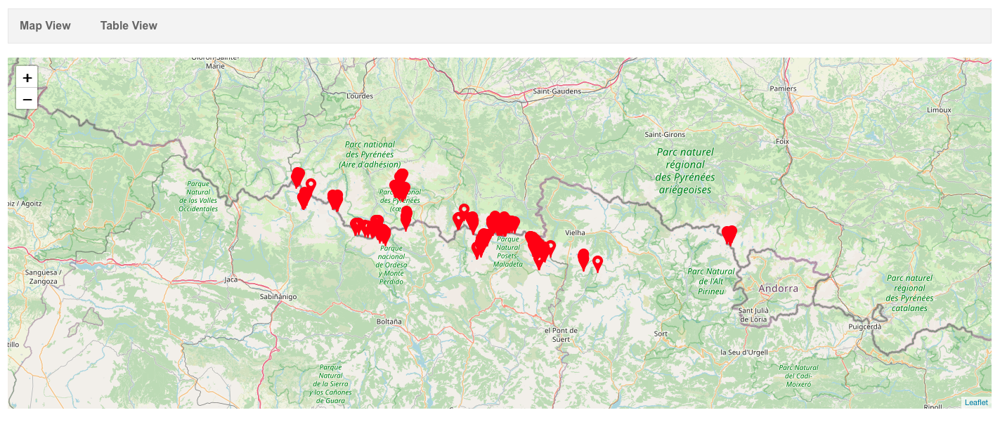
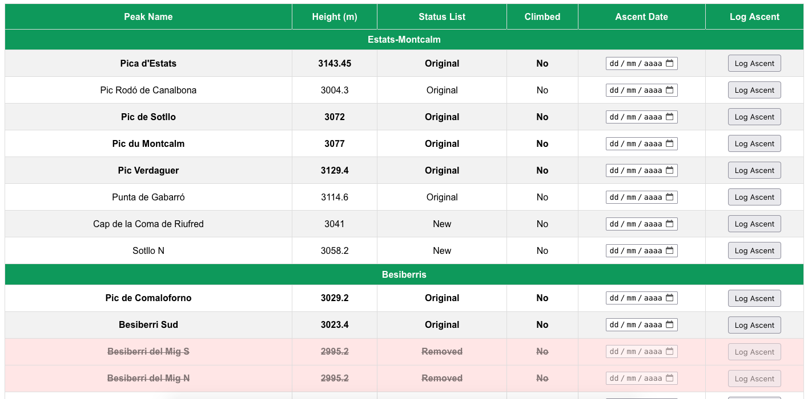

# My 3000 Pyrenees

**My 3000 Pyrenees** is a web-based application that allows users to track and visualize their ascents of 3,000-meter peaks in the Pyrenees mountain range. This tool is ideal for hikers, mountaineers, and adventurers looking to log and celebrate their achievements.

The app provides an interactive map, statistics on ascents, and the ability to customize your peak-climbing journey.

> Disclaimer Information and Instructions
  <ul>
    <!-- <li>- GPS Coordinates are taken from OpenStreetMap so the visualisation on the map matches.</li> -->
    <li>Altitude/elevation is taken from OpenStreetMap and there are many errors (Work in progress).</li>
    <li>We are putting in place visualisation of the peaks if they are from the first official UIAA list or modified later (Work in progress).</li>
    <li>If you erase navigation data or use private navigation tools, the site won't be able to store your ascents.</li>
    <li>You can export your data anytime using the "Download Data", it will save a json file in your computer.</li>
    <li>Update a previously downloaded file with the "Import Downloaded Data" button".</li>
    <li>Data has been extracted from the <a href="https://cazafantasmas3000es.blogspot.com" target="_blank">Cazafantasmas3000es blog</a>, so we include the original list and the "new" list with removed and added peaks.</li>
    <li>Main peaks are in bolt. Removed peaks from the original list following the original criteria are marked as so.</li>
    <li>For details with problems with data integrity and data accuracy, please read the popup from <a href="https://victorivus.github.io/my-3000-Pyrenees/table.html">the website</a>.</li>
  </ul>

## Live Demo
Check out the live version of the project here:  
[My 3000 Pyrenees](https://victorivus.github.io/my-3000-Pyrenees)

## Table of Contents
- [About the Project](#about-the-project)
- [Features](#features)
- [Screenshots](#screenshots)
- [Installation](#installation)
- [Usage](#usage)
- [Contributing](#contributing)
- [License](#license)

## About the Project
The Pyrenees mountain range boasts 11 peaks that rise above 3,000 meters. This project helps you track your progress as you summit these impressive mountains. The app visualizes completed and pending ascents on a dynamic map.

### Motivation
The project was developed out of a passion for climbing and exploring the Pyrenees. It serves as a personal ascent log but is open for anyone who wants to track their climbing milestones.

## Features
- **Interactive map** showing all 3,000-meter peaks in the Pyrenees.
- **Track completed ascents** and update your progress visually.
- **\* Log additional details** such as date, route, and difficulty for each peak.
- **\* View ascent statistics**, including a summary of remaining and completed peaks.
- **Accessible on any modern web browser** (mobile and desktop).

\* Comming soon...

## Screenshots
This is how the map looks. Already logged ascents will show in green, they can be logged both on the map or on the table, it gets automatically updated.

Main peaks are in bold and secondary ones in normal characters. Peaks that have been recently removed from the original list are still listed but dashed and with a red backround.

  

Hovering the mouse on the height column shows aditional information if available (latest meaures by different entities such as French IGN, Aragonian SITAR, or Catalan ICC)



## Installation
If you'd like to run the project locally, follow these steps:

### Clone the repository
```bash
git clone https://github.com/Victorivus/my-3000-Pyrenees.git
cd my-3000-Pyrenees
```

You would then need to setup a server or fork the Github repository and setup a [Github Pages](https://docs.github.com/en/pages/quickstart) 